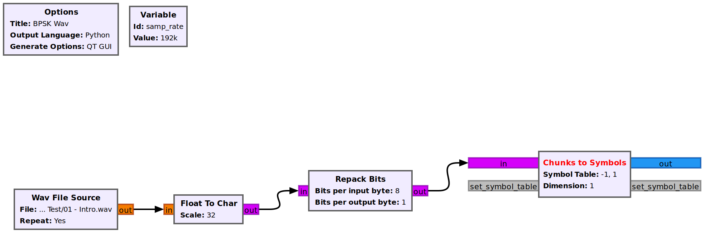

Getting started with gnuradio 3.8 and rpitx/rtl-sdr
===================================================

First, install gnuradio

.. code-block:: bash

        sudo apt update
        sudo apt upgrade
        sudo apt install gnuradio

Then, to communicate to *rpitx* via **TCP** install the *gr-grnet* package which can be obtained here:

https://github.com/ghostop14/gr-grnet.git

Might be necessary to install *swig* and other packages to *cmake* run without errors.

Please note that the *tcp-server* block bundled with the gnuradio doesn't work (it refuses all connections with *rpitx* without a motive).

Creating a BPSK/QPSK modulation
===============================

Creating a BPSK with *wav* file
-------------------------------

First, place an *wav* audio file in the project's directory, then add the *Wav File Source* block with the following parameters:

.. code-block:: text

        * File: name of the wav audio file
        * Repeat: either Yes or No
        * N Channels: 1

Then, use the *Float To Char* block to convert the wav data into char arrays, with *Scale* set to 32.

Now, to convert the raw data to BSPK modulation, use the *Repack Bits* with 8 bits per input byte and 1 bit per output byte, since the BPSK modulation will generate a pair of symbols mapped to (0,1). 

To effectively convert the individual bits to symbols, use the *Chunks to Symbols* block with the following parameters:

.. code-block:: text

        * Input Type: byte
        * Output Type: complex
        * Symbol Table: [0, 1]
        * Dimention: 1
        * Num Ports: 1

The image below illustrates the flowgraph with the steps taken so far:

